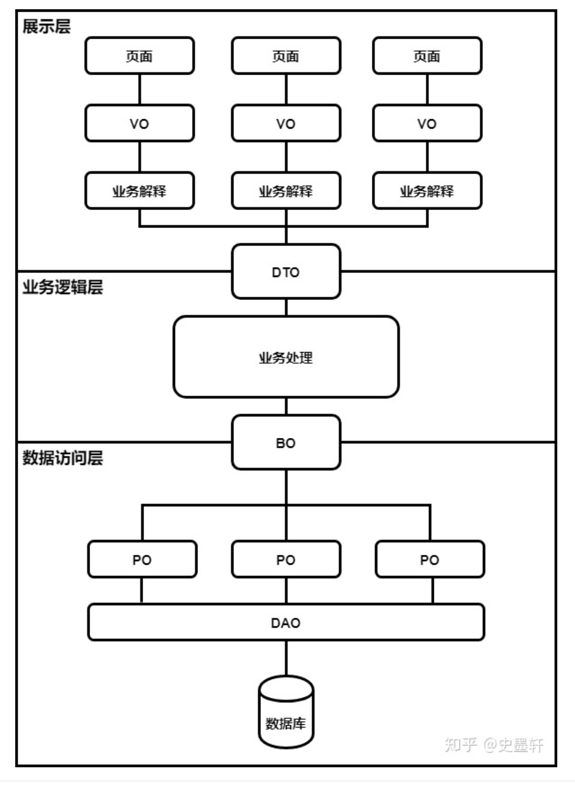

# Pre-Knowledge
### VO，BO，PO，DO，DTO:
[一篇文章讲清楚VO，BO，PO，DO，DTO的区别 - 知乎](https://zhuanlan.zhihu.com/p/102389552)

# Design Entities to represent your data:
You’ll need to decide how to persist your information. To complete this project, you will need to store the following:

Two different kinds of users - Employees and Customers.
Any type of pet, such as cats, dogs, lizards, hedgehogs, toucans, etc. We don't want to discriminate against owners of odd pets!
Schedules that indicate one or more employees will be meeting one or more pets to perform one or more activities on a specific day.
As you consider your design, think about how you want these entities to be stored in your database. 
Be deliberate about whether you are representing data via inheritance or composition and use the tools 
that Spring and Hibernate provide to create the appropriate tables to relate your data. 

Remember that the Data Transfer Objects represent the structure of request and response data, 
but do not have to represent the structure of your persistence model. 
The Data Transfer Objects are represented by the [NAME]DTO.java files in the starter code.

- Employees
- Customers
- pet
# Task 4: Create Tables in your Database
There are a variety of ways to create the tables your program will use. Hibernate can automatically generate them when you launch the application, or you may use a schema.sql to manually define and create the tables. Automatic generation is a simpler, quicker solution and recommended for this project. Just as some of your furry clients would choose to Hibernate, we suggest the same! That being said, you may choose any method you wish.

Once your tables are constructed, review the schema in MySQL workbench or in another tool of your choice. Hibernate’s HQL and Spring Data’s JPQL allow you to work with Java objects, but it’s still useful to look at the SQL schema verify your Entity design produces the type of tables you want.
```sql
create user 'sa'@'localhost' identified by 'sa1234'; -- Create the user--
grant all on critter.* to 'sa'@'localhost'; -- Gives all privileges to that user on new db
```
# Task 5: Create a Data Access Layer
It’s important to isolate requests to the database from the business logic of our application in order to minimize the impact of changes. In other words, we want a pet door to let your marmot, wombat, and capybara reach the database while keeping your product owner out. There are a variety of ways to do this. You can use the Data Access Object pattern, Spring Data Repositories, or some combination thereof to create a single DAO or Repository for each type of Entity you created in the previous step. These will handle persistence requests pertaining to those Entities.

For this project, you may elect to use any of the persistence strategies discussed in this course. That could mean using a JdbcTemplate to execute native queries, using Hibernate and EntityManager, or using Spring Data JPA. Regardless of your approach, be sure to encapsulate persistence logic inside your Data layer.

## JPA Repositories customer rule:
[2. JPA Repositories](https://docs.spring.io/spring-data/jpa/docs/1.5.0.RELEASE/reference/html/jpa.repositories.html)

# Task 6: Create a Service Layer
This project is designed so that the majority of the work can be performed by the Data layer, but you still need another layer that can combine calls to multiple DAOs or Repositories. Create Service objects that can handle requests from the Controller layer and make the appropriate calls to the Data layer. Avoid exposing the starter code’s DTO objects to your Service layer. The Service layer should work with Entities or primitives, but not DTOs.